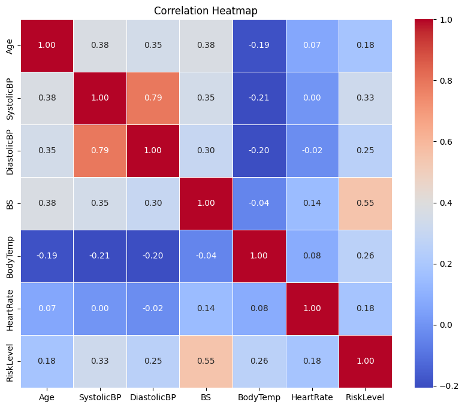
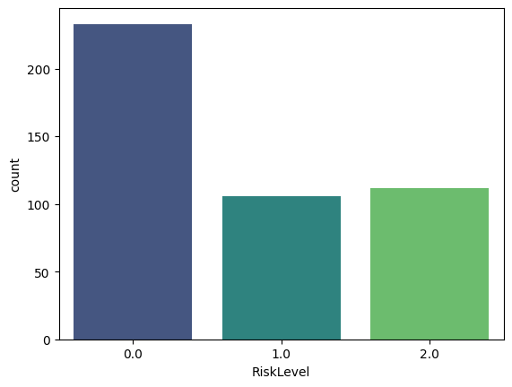
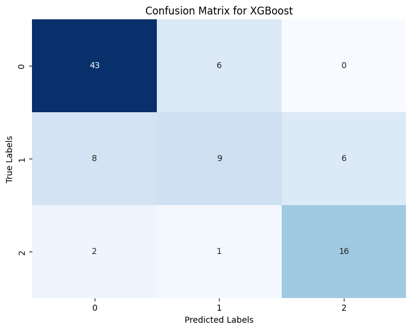
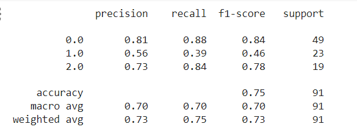
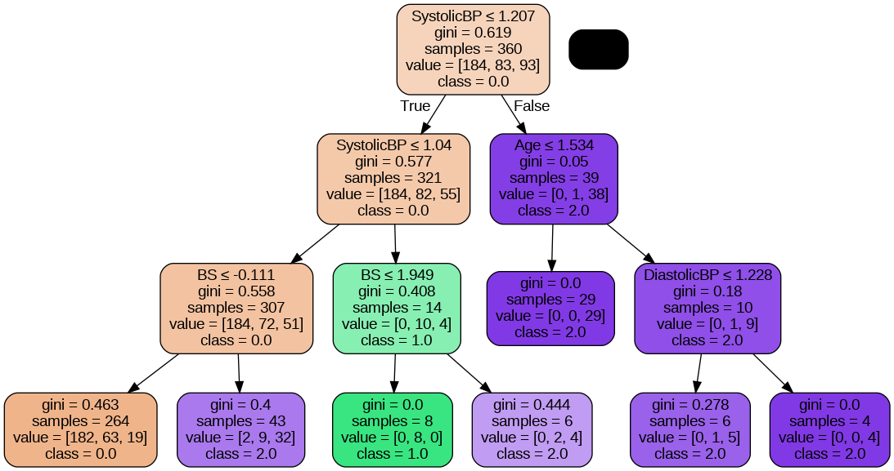

# Project Report

## Problem selection

This project aims to develop a predictive model for assessing the health status of pregnant women using data from hospitals, community clinics, and maternal health centers via an IoT-based risk monitoring system. It utilizes essential health parameters like age, blood pressure, blood glucose levels, and heart rate to predict health status accurately. By employing advanced machine learning algorithms, the goal is to create a robust model capable of early detection and personalized management of pregnancy-related risks, ultimately improving maternal and fetal outcomes.

## Dataset selection

To implement this project I have taken a dataset from ['Kaggle' ](https://www.kaggle.com/datasets/csafrit2/maternal-health-risk-data/data). In this dataset the data has been collected from  from different hospitals, community clinics, maternal health cares through the IoT based risk monitoring system. Consider about the parameters in the dataset, 
* Age: Age in years when a woman is pregnant.
* SystolicBP: Upper value of Blood Pressure in mmHg, another significant attribute during pregnancy.
* DiastolicBP: Lower value of Blood Pressure in mmHg, another significant attribute during pregnancy.
* BS: Blood glucose levels is in terms of a molar concentration, mmol/L.
* HeartRate: A normal resting heart rate in beats per minute.
* Risk Level: Predicted Risk Intensity Level during pregnancy considering the previous attribute.

So here I have selected the 'Risk Level' data column as the target value for my project and I considered other columns as features.

## Data preprocessing

In the data preprocessing phase of the project, several essential steps were taken to ensure the quality and usability of the dataset. Initially, a thorough check was conducted to identify and handle any missing values within the dataset, ensuring data completeness. Subsequently, duplicate records were identified and removed to maintain data integrity and avoid redundancy, with corresponding labels assigned to flag any duplicated entries for reference. Following this, the target variable, representing the risk level, was numerically mapped using a predefined mapping dictionary, facilitating uniformity and compatibility for subsequent analysis and modeling tasks.

To address potential outliers that could skew the analysis, a boxplot visualization was employed to identify outliers in the dataset, focusing on the heart rate attribute. Outliers were then removed from the heart rate column to mitigate their potential impact on the modeling process. Further exploration involved examining the correlations between different features and the target variable, providing insights into potential relationships and informing feature selection strategies.

Finally, to ensure uniformity and comparability across features, data scaling was applied using the StandardScaler function, standardizing the feature variables' scale to facilitate optimal model performance during training and evaluation. These preprocessing steps collectively contribute to enhancing the dataset's quality, preparing it for subsequent modeling tasks to predict the health status of pregnant women with increased accuracy and reliability.

Below image shows the correlation between each columns

Below image shows the value counts for each class in the target variable

## Model selection

Because this is classification problem I have implemeneted five models to predict results. They are SVM classifier, XGBoost classifier, Decision Tree classifier, Rndom Forest Classifier and Logistic regression model. For each model I have implemented the metyhodology of hyper parameter tunning to get best model using GridSearchCV. In the evaluation I have used confusion matrix and also classification report. According to the results I got higher accuracy for the XGBoost classifier. Below images will show Ho I implemenet those.

Below image show the evaluation using confusion matrix

Below image show the evaluation using classification matrix

Below image shows the generated decison tree for the project

